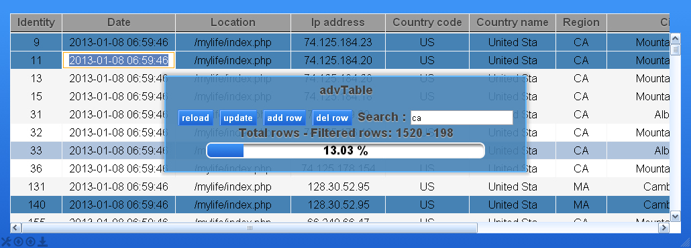

advTable jQuery-plugin
==========================

User friendly table handler

- editable content
- selectable row
- multi select row
- source select (database or file or html)
- filterable content
- download filtered content
- password protected database update with timeout
- resizeable

*version 1.1.0 Add HTML5 datepicker
Enable HTML5 date picker. Check field data. If this date or datetime then enable browser HTML5 datepicker.

Demo : http://atandrastoth.co.uk/advtable/

Author: Tóth András
